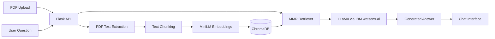

# Building-Chatbot-Using-LLAMA-and-RAG


# PDF Chatbot with LLaMA and RAG

An end-to-end **Retrieval-Augmented Generation application** that allows users to upload a PDF and ask questions about its content.

The application uses **LLaMA through IBM watsonx.ai**, LangChain, Hugging Face embeddings, ChromaDB, Flask, and a browser-based chat interface.

## Demo

| Upload a PDF                               | Ask Questions                                  |
| ------------------------------------------ | ---------------------------------------------- |
|  |  |

## Overview

Large Language Models may generate answers without access to the correct information. This project uses Retrieval-Augmented Generation to provide the model with relevant passages from an uploaded document before generating an answer.

The workflow is:

1. The user uploads a PDF.
2. Text is extracted from the document.
3. The text is divided into overlapping chunks.
4. Each chunk is converted into an embedding.
5. The embeddings are stored in ChromaDB.
6. Relevant chunks are retrieved for each question.
7. LLaMA generates an answer using the retrieved context.

## Architecture



## Key Features

* PDF upload and processing
* Document-based question answering
* Retrieval-Augmented Generation pipeline
* LLaMA integration through IBM watsonx.ai
* Semantic search using Hugging Face embeddings
* ChromaDB vector storage
* Maximum Marginal Relevance retrieval
* Flask REST API
* Responsive browser chat interface
* Light and dark modes
* Automatic CPU or GPU selection
* Docker support

## Technology Stack

### AI and Retrieval

* LLaMA
* IBM watsonx.ai
* LangChain
* Hugging Face Sentence Transformers
* ChromaDB
* PyPDF

### Backend

* Python
* Flask
* Flask-CORS

### Frontend

* HTML
* CSS
* JavaScript
* Bootstrap
* jQuery

### Deployment

* Docker
* Git and GitHub

## Project Structure

```text
Building-Chatbot-Using-LLAMA-and-RAG/
├── images/
├── static/
│   ├── script.js
│   └── style.css
├── templates/
│   └── index.html
├── worker.py
├── worker_huggingFace.py
├── server.py
├── requirements.txt
├── Dockerfile
└── LICENSE
```

## Installation

### 1. Clone the repository

```bash
git clone https://github.com/Raphlawren/Building-Chatbot-Using-LLAMA-and-RAG.git
cd Building-Chatbot-Using-LLAMA-and-RAG
```

### 2. Create a virtual environment

```bash
python -m venv .venv
source .venv/bin/activate
```

On Windows:

```powershell
.venv\Scripts\activate
```

### 3. Install the dependencies

```bash
pip install -r requirements.txt
```

## IBM watsonx.ai Configuration

Set your IBM watsonx.ai API key:

```bash
export WATSONX_APIKEY="your-api-key"
```

Update the project ID in `worker.py`:

```python
PROJECT_ID = "your-watsonx-project-id"
```

## Running the Application

```bash
python server.py
```

Open the application in your browser:

```text
http://localhost:8000
```

Upload a PDF and begin asking questions about its content.

## Running with Docker

Build the image:

```bash
docker build -t llama-rag-chatbot .
```

Run the container:

```bash
docker run --rm \
  -p 8000:8000 \
  -e WATSONX_APIKEY="$WATSONX_APIKEY" \
  llama-rag-chatbot
```

## What This Project Demonstrates

This project demonstrates practical experience with:

* Building end-to-end Generative AI applications
* Designing Retrieval-Augmented Generation pipelines
* Working with embeddings and vector databases
* Integrating foundation models through cloud APIs
* Developing REST APIs with Flask
* Connecting AI backends to user-facing applications
* Containerizing Python applications with Docker

## Current Limitations

This repository is a portfolio implementation and is not yet designed for production use.

Current limitations include:

* One active document collection at a time
* In-memory vector storage
* No user authentication
* No source citations in generated answers
* No isolated multi-user sessions
* No automated tests

## Future Improvements

* Display source pages with generated answers
* Support multiple PDFs
* Add persistent vector storage
* Add authentication and user sessions
* Add automated testing and CI/CD
* Add retrieval and response evaluation
* Deploy with a production WSGI server

## Author

**Raphael Farodoye**

Data Scientist | Machine Learning | Generative AI

[LinkedIn](https://www.linkedin.com/in/raphael-farodoye-81035b28b/) · [GitHub](https://github.com/Raphlawren)
